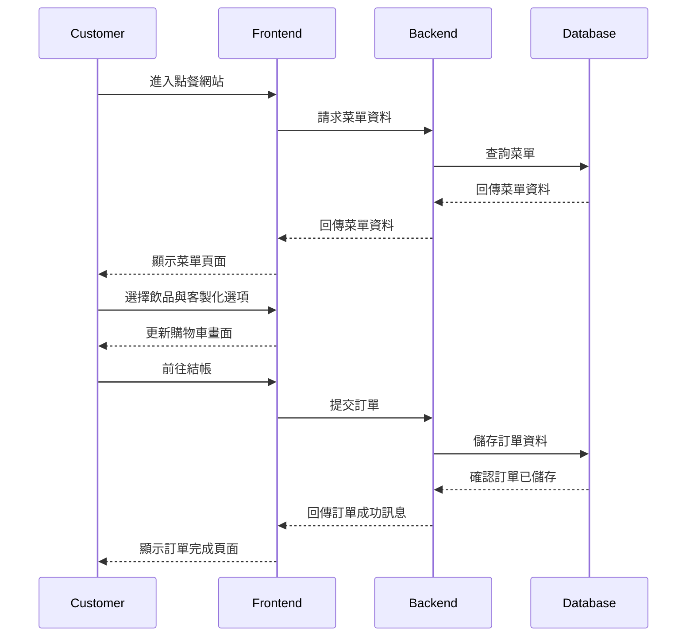

```mermaid
sequenceDiagram
    participant 顧客 as Customer
    participant 前端 as Frontend
    participant 後端 as Backend
    participant 資料庫 as Database

    顧客->>前端: 進入點餐網站
    前端->>後端: 請求菜單資料
    後端->>資料庫: 查詢菜單
    資料庫-->>後端: 回傳菜單資料
    後端-->>前端: 回傳菜單資料
    前端-->>顧客: 顯示菜單頁面

    顧客->>前端: 選擇飲品與客製化選項
    前端-->>顧客: 更新購物車畫面

    顧客->>前端: 前往結帳
    前端->>後端: 提交訂單
    後端->>資料庫: 儲存訂單資料
    資料庫-->>後端: 確認訂單已儲存
    後端-->>前端: 回傳訂單成功訊息
    前端-->>顧客: 顯示訂單完成頁面
```
