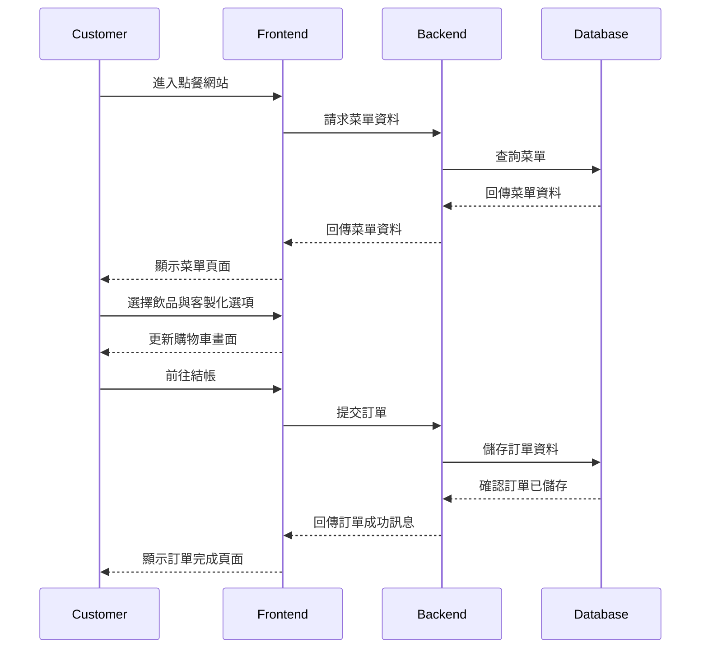

這是一份依照您的 **REQ.md** (需求)、**SA 規格定義** 以及 **AI 自我稽核規則** 所重新生成的 **系統分析文件（SA.md）**。

根據教材定義，**SA 是「系統的骨架」與「廚房配置圖」**。與 SD（著重資料表與 API）不同，SA 的重點在於**定義頁面結構 (Page Architecture)** 與 **系統分層**，這是讓 AI 生成專案目錄結構與 Controller/View 檔案的關鍵依據。

---

# 系統分析文件 (SA.md) - 點飲料點餐系統

## 1. 系統分層概觀 (System Layer Overview)
本系統採用前後端分離或 MVC 架構設計，將系統劃分為以下層級，以符合 REQ 中提到的擴充性需求。

*   **展示層 (Presentation Layer / Frontend)**
    *   **顧客前台**: 提供 RWD 響應式網頁，供顧客瀏覽菜單、下單與追蹤狀態。
    *   **管理後台**: 提供需身分驗證的管理介面，供店員接單與管理員維護資料。
*   **服務層 (Service Layer / Backend)**
    *   處理核心業務邏輯（如：訂單金額計算、庫存檢查、狀態流轉控制）。
    *   提供 RESTful API 供前端呼叫。
*   **資料層 (Data Access Layer / Repository)**
    *   負責與資料庫進行互動 (CRUD)。
*   **資料庫 (Database)**
    *   使用 MySQL 儲存持續性資料。

---

## 2. 系統元件 (System Components)
根據 REQ 的功能列表，將系統劃分為四大功能模組：

### (1) 菜單與商品模組 (Menu Component)
*   **職責**: 管理飲品的上架、下架、價格與圖片顯示。
*   **對應 REQ**: F1 (瀏覽), B4 (管理)。

### (2) 訂單交易模組 (Order Component)
*   **職責**: 處理購物車暫存、訂單建立、客製化參數記錄 (甜度/冰塊)、以及狀態流轉。
*   **對應 REQ**: F2 (客製化), F3 (購物車), F4 (結帳), F5 (追蹤), B1-B3 (後台接單)。
*   **MVP 策略**:
    *   **移除**: 地圖定位外送功能。
    *   **調整**: 即時通知 (B1) 不使用 WebSocket，改採 **前端輪詢 (Polling)** 機制（每 30 秒更新），以確保三週內可交付。

### (3) 使用者與權限模組 (Auth Component)
*   **職責**: 處理店員與管理員的登入驗證、角色權限控管 (RBAC)。
*   **對應 REQ**: 系統角色 (Admin/Staff/Customer)。

### (4) 報表模組 (Report Component)
*   **職責**: 統計每日/每週銷售額。
*   **對應 REQ**: B5。

---

## 3. 頁面架構 (Page Architecture) — **核心章節**
此章節定義了前端需要開發的頁面，這是 AI 生成 View (HTML/Vue) 與 Controller 的依據。

### (A) 前台頁面清單 (Customer UI)
| 頁面代號 | 頁面名稱 | 功能描述 | 對應 REQ |
| :--- | :--- | :--- | :--- |
| `pg_menu_list` | **菜單首頁** | 顯示飲品分類與卡片列表 (圖片/名稱/價格)。 | F1 |
| `pg_item_detail` | **飲品詳情/彈窗** | 選擇甜度、冰塊、數量，點擊「加入購物車」。 | F2 |
| `pg_cart` | **購物車頁** | 列表顯示已選項目，可修改數量或移除，顯示總金額。 | F3 |
| `pg_checkout` | **結帳確認頁** | 選擇付款方式 (LINE Pay/信用卡)，送出訂單。 | F4 |
| `pg_order_track` | **訂單追蹤頁** | 顯示訂單進度 (準備中/可取餐) 與訂單明細。 | F5 |

### (B) 後台頁面清單 (Admin/Staff UI)
| 頁面代號 | 頁面名稱 | 功能描述 | 對應 REQ |
| :--- | :--- | :--- | :--- |
| `pg_admin_login` | **後台登入頁** | 店員與管理員的登入入口。 | - |
| `pg_staff_dashboard`| **接單管理看板** | **(核心)** 顯示「待處理」訂單，提供「開始製作/完工」按鈕。(需自動刷新) | B1, B2 |
| `pg_order_history` | **歷史訂單查詢** | 列表顯示所有已完成訂單，可依日期搜尋。 | B3 |
| `pg_prod_list` | **商品管理列表** | 顯示所有飲品，提供新增、編輯、刪除按鈕。 | B4 |
| `pg_prod_edit` | **商品編輯/新增頁** | 輸入名稱、價格、上傳圖片、設定分類與上下架。 | B4 |
| `pg_sales_report` | **銷售報表頁** | 顯示日期區間內的銷售總額統計。 | B5 |

---

## 4. 系統架構圖 (Architecture Diagram)
使用 Mermaid 描述 MVC 資料流向。

##```mermaid
graph TD
subgraph Client [用戶端]
Browser[瀏覽器 (HTML5/JS)]
end

    subgraph Backend [後端伺服器 (Spring Boot)]
        Controller[Web Controller (接收請求)]
        Service[Service Layer (業務邏輯)]
        Repo[Repository (資料存取)]
    end

    subgraph Database [資料儲存]
        DB[(MySQL Database)]
    end

    %% 流程
    Browser -->|1. HTTP Request (GET/POST)| Controller
    Controller -->|2. 呼叫方法| Service
    Service -->|3. CRUD 操作| Repo
    Repo -->|4. SQL Query| DB
    DB -->|5. ResultSet| Repo
    Repo -->|6. Entity Object| Service
    Service -->|7. DTO| Controller
    Controller -->|8. JSON Response| Browser
```
##
---

## 5. 技術選用 (Technology Selection)
依據專案規範 與 REQ：

*   **後端框架**: Java 17+, Spring Boot 3.x (Spring Web, Spring Data JPA)。
*   **前端介面**: HTML/CSS/JavaScript (搭配 Axios 呼叫 API)。
*   **資料庫**: MySQL 8.0 (正式區) / H2 (開發測試區)。
*   **建置工具**: Gradle 或 Maven。
*   **版本控制**: Git。

---

## 6. 邏輯流程概觀 (Page Logic Flow)
簡述使用者在頁面間的跳轉邏輯。

1.  **顧客點餐路徑**:
    進入 `pg_menu_list` → 點擊商品開啟 `pg_item_detail` → 加入購物車 → 進入 `pg_cart` 確認 → 跳轉 `pg_checkout` 付款 → 導向 `pg_order_track` 等待。

2.  **店員接單路徑**:
    進入 `pg_admin_login` → 登入成功導向 `pg_staff_dashboard` → (Polling 收到新單) → 點擊按鈕更新狀態 (畫面即時變更)。

3.  **管理員路徑**:
    登入後進入 `pg_prod_list` → 點擊「新增」進入 `pg_prod_edit` → 儲存後返回列表。

---

## 💡 自我稽核確認 (Self-Audit Check)
在進入 SD (系統設計) 前，請確認本 SA 是否符合：

1.  **頁面完整性**: 是否包含了 REQ B4 的「商品編輯頁」？ **(是，`pg_prod_edit`)**。
2.  **功能對應**: 是否包含了 REQ F5 的「訂單追蹤頁」？ **(是，`pg_order_track`)**。
3.  **MVP 可行性**: 是否移除了 REQ 中複雜的「外送地圖」？ **(是，僅保留店內取餐流程)**。

此 SA 文件已定義好「頁面」與「骨架」，接下來請使用 **SD.md** 來定義詳細的「資料表欄位」與「API 參數」。
