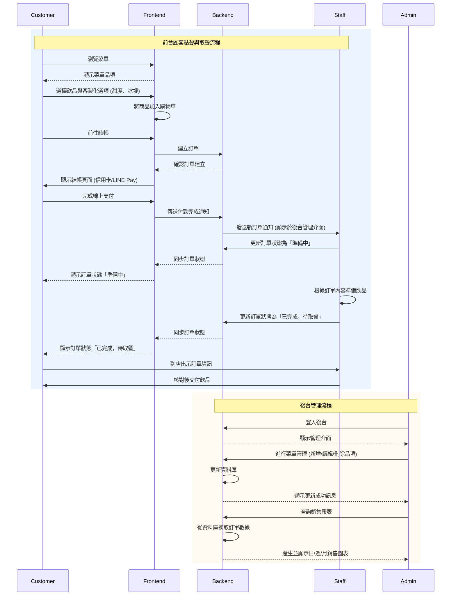

# 系統架構圖

```mermaid
sequenceDiagram
    participant 顧客 as Customer
    participant 前台系統 as Frontend
    participant 後台系統 as Backend
    participant 店員 as Staff
    participant 管理員 as Admin

    rect rgb(235, 245, 255)
    note over 顧客, 店員: 前台顧客點餐與取餐流程

    顧客->>前台系統: 瀏覽菜單
    前台系統-->>顧客: 顯示菜單品項

    顧客->>前台系統: 選擇飲品與客製化選項 (甜度、冰塊)
    前台系統->>前台系統: 將商品加入購物車

    顧客->>前台系統: 前往結帳
    前台系統->>後台系統: 建立訂單
    後台系統-->>前台系統: 確認訂單建立

    前台系統->>顧客: 顯示結帳頁面 (信用卡/LINE Pay)
    顧客->>前台系統: 完成線上支付
    前台系統->>後台系統: 傳送付款完成通知

    後台系統->>店員: 發送新訂單通知 (顯示於後台管理介面)
    店員->>後台系統: 更新訂單狀態為「準備中」
    後台系統-->>前台系統: 同步訂單狀態
    前台系統-->>顧客: 顯示訂單狀態「準備中」

    店員->>店員: 根據訂單內容準備飲品
    店員->>後台系統: 更新訂單狀態為「已完成，待取餐」
    後台系統-->>前台系統: 同步訂單狀態
    前台系統-->>顧客: 顯示訂單狀態「已完成，待取餐」

    顧客->>店員: 到店出示訂單資訊
    店員->>顧客: 核對後交付飲品
    end

    rect rgb(255, 250, 240)
    note over 管理員, 後台系統: 後台管理流程

    管理員->>後台系統: 登入後台
    後台系統-->>管理員: 顯示管理介面

    管理員->>後台系統: 進行菜單管理 (新增/編輯/刪除品項)
    後台系統->>後台系統: 更新資料庫
    後台系統-->>管理員: 顯示更新成功訊息

    管理員->>後台系統: 查詢銷售報表
    後台系統->>後台系統: 從資料庫撈取訂單數據
    後台系統-->>管理員: 產生並顯示日/週/月銷售圖表
    end
```
