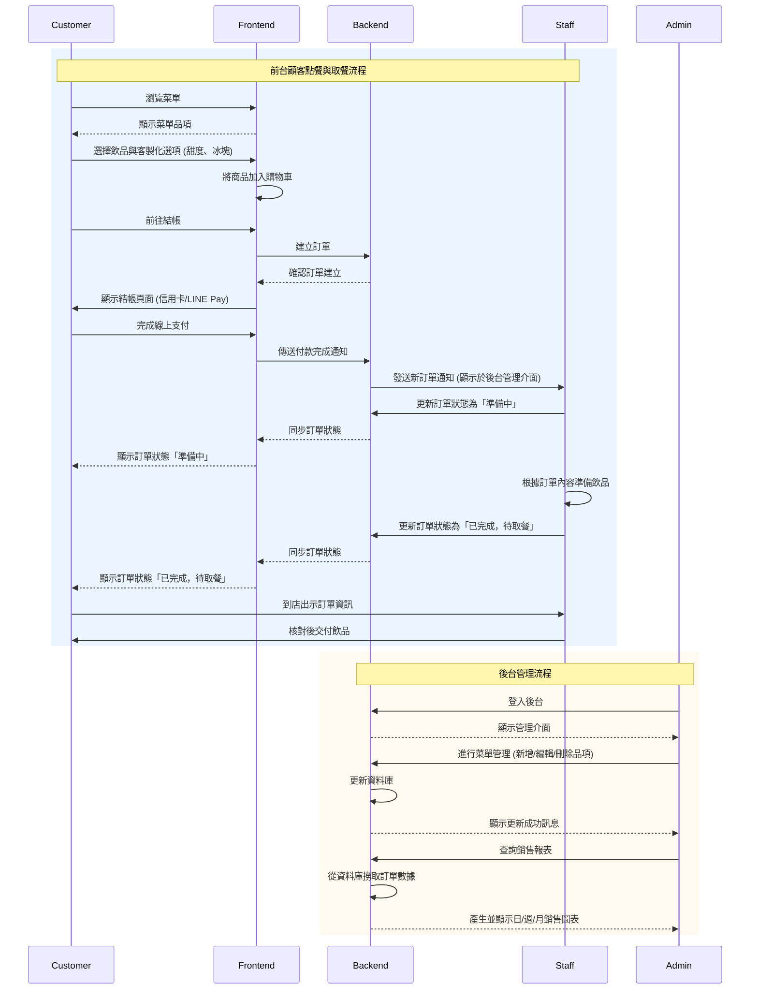

# 系統架構圖

點飲料點餐系統 — 系統設計文件（SD.md）

本文件為「程式碼生成可用」之 SD（System Design），內容包含資料庫結構、API 規格、詳細時序圖、主要流程敘述與前端 UI 元件設計。
SA（架構圖）內容已正確移至 SA.md。

1. 資料庫設計（Database Design）
   1.1 menu_items（飲品資訊）
   欄位	類型	說明
   id	INT AUTO_INCREMENT PK	飲品編號
   name	VARCHAR(100)	飲品名稱
   price	INT	售價
   description	TEXT	商品介紹
   image_url	VARCHAR(255)	商品圖片
   sugar_options	JSON	甜度可選值
   ice_options	JSON	冰塊可選值
   toppings_options	JSON	加料選項
   1.2 orders（訂單主表）
   欄位	類型	說明
   id	INT AUTO_INCREMENT PK	訂單 ID
   customer_name	VARCHAR(100)	顧客名稱
   total_amount	INT	訂單總金額
   payment_method	ENUM('credit_card','line_pay')	支付方式
   status	ENUM('PENDING','PROCESSING','READY','FINISHED')	訂單狀態
   created_at	DATETIME	建立時間
   1.3 order_items（訂單細項）
   欄位	類型	說明
   id	INT AUTO_INCREMENT PK
   order_id	INT FK → orders.id	所屬訂單
   item_id	INT FK → menu_items.id	飲品編號
   quantity	INT	數量
   sugar	VARCHAR(20)	甜度
   ice	VARCHAR(20)	冰塊
   toppings	JSON	加料
   1.4 users（後台帳號）
   欄位	類型	說明
   id	INT AUTO_INCREMENT PK
   username	VARCHAR(50)	帳號
   password	VARCHAR(255)	密碼（雜湊）
   role	ENUM('staff','admin')	角色
2. API 設計（API Design）
   2.1 Menu API
   GET /api/menu

回傳所有飲品資料。

Response：

[
{
"id": 1,
"name": "珍珠奶茶",
"price": 55,
"image_url": "/img/boba.jpg",
"sugar_options": ["正常", "半糖", "微糖"],
"ice_options": ["正常冰", "少冰", "去冰"],
"toppings_options": ["珍珠", "椰果"]
}
]

2.2 Order API
POST /api/orders

建立訂單。

Request：

{
"customerName": "王曉明",
"paymentMethod": "line_pay",
"items": [
{
"itemId": 1,
"quantity": 2,
"sugar": "微糖",
"ice": "去冰",
"toppings": ["珍珠"]
}
]
}

GET /api/orders/{orderId}

查詢訂單狀態。

Response：

{
"orderId": 1032,
"status": "PROCESSING"
}

PUT /api/orders/{orderId}/status

更新訂單狀態（店員）。

Request：

{
"status": "READY"
}

2.3 Admin / Staff API
POST /api/admin/menu — 新增飲品
PUT /api/admin/menu/{id} — 編輯飲品
GET /api/admin/reports — 銷售報表
3. 詳細時序圖（Sequence Diagram）
   sequenceDiagram
   participant Customer
   participant Frontend
   participant Backend
   participant Database

   %% --- 顧客瀏覽菜單 ---
   Customer->>Frontend: 開啟網站
   Frontend->>Backend: GET /api/menu
   Backend->>Database: SELECT * FROM menu_items
   Database-->>Backend: 回傳資料
   Backend-->>Frontend: Menu JSON
   Frontend-->>Customer: 顯示菜單

   %% --- 建立訂單 ---
   Customer->>Frontend: 提交訂單
   Frontend->>Backend: POST /api/orders
   Backend->>Database: INSERT INTO orders
   Backend->>Database: INSERT INTO order_items
   Database-->>Backend: 成功
   Backend-->>Frontend: 回傳 orderId
   Frontend-->>Customer: 顯示訂單完成頁

   %% --- 店員更新狀態 ---
   Backend->>Frontend: 推播新訂單通知
   Staff->>Backend: PUT /orders/{id}/status
   Backend->>Database: UPDATE orders
   Database-->>Backend: 成功
   Backend-->>Frontend: 狀態更新
   Frontend-->>Customer: 顯示最新狀態

4. Main Flow（主要流程）
   4.1 顧客建立訂單流程

前端傳送 JSON（品項、甜度、冰塊、加料）。

後端驗證商品是否存在。

計算總金額。

orders 新增一筆紀錄。

order_items 新增 N 筆子項目。

回傳訂單編號。

4.2 店員更新訂單狀態流程

後台傳送新的 status（PENDING、PROCESSING、READY、FINISHED）。

後端驗證 ENUM。

更新 orders.status。

推播通知顧客端。

回傳成功訊息。

4.3 顧客查詢訂單狀態流程

後端依 orderId 查詢 orders。

查無 → 404。

查獲 → 回傳完整狀態。

5. UI Components（畫面元件設計）
   5.1 前台 — 菜單頁

飲品卡片（圖片 / 價格 / 名稱）

客製化選項（甜度 / 冰塊 / 加料）

加入購物車按鈕

購物車列表

前往結帳按鈕

5.2 結帳頁

品項列表

總金額計算

信用卡 / LINE Pay 選項

送出訂單按鈕

5.3 後台 — 店員端

新訂單清單

訂單詳細資訊（含客製化）

訂單狀態按鈕（PROCESSING → READY → FINISHED）

5.4 後台 — 管理員端

菜單新增 / 編輯 / 刪除

銷售圖表（日 / 週 / 月）

帳號登入與權限控管