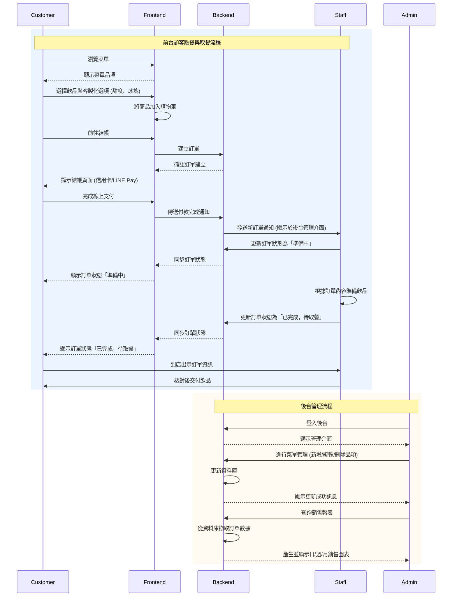
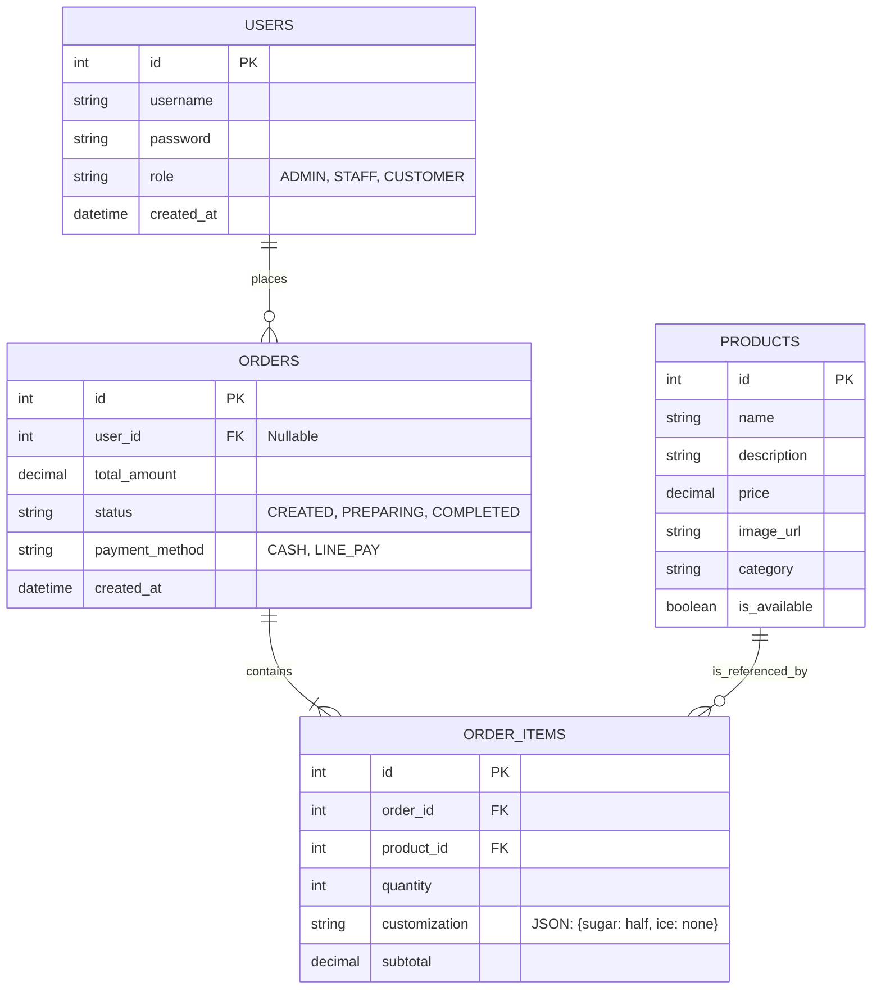
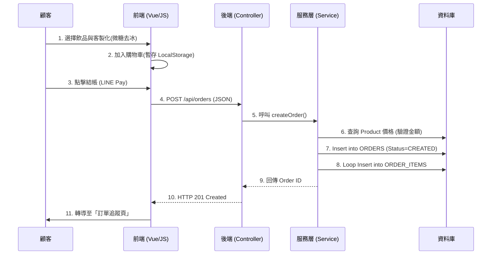
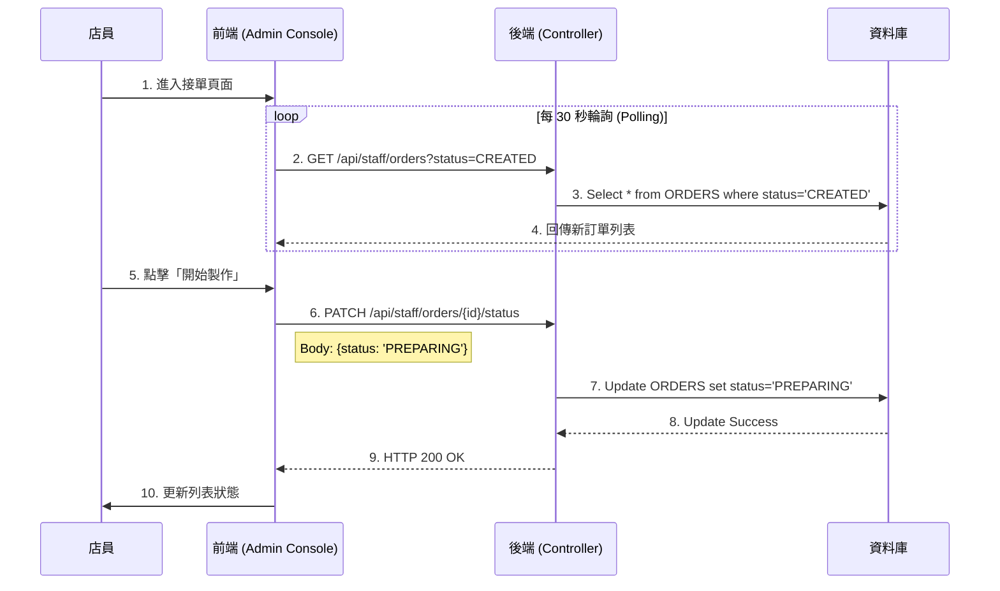

# 系統架構圖


這是一份包含 **Mermaid圖表** 的完整 **系統設計文件（SD.md）**。

這份設計文件整合了您的 REQ（需求）、SA（架構）以及「AI 專案文件自我稽核規則」的要求。我已將架構圖、ERD 關聯圖以及時序圖加入其中，讓 AI (Gemini CLI) 能更精準地理解程式邏輯。

您可以直接將以下內容複製為 `SD.md`。

---

# 系統設計文件 (SD.md) - 點飲料點餐系統

## 一、系統架構設計 (System Architecture)

本系統採用標準的 MVC 分層架構（Model-View-Controller），前端與後端透過 RESTful API 進行溝通。

### 1. 架構圖 (Mermaid Diagram)
```mermaid
graph TD
    subgraph Client [使用者端]
        Browser[瀏覽器 (HTML/JS/Vue or Thymeleaf)]
    end

    subgraph Backend [後端伺服器 (Spring Boot)]
        Controller[Web Controller / REST API]
        Service[Service Layer (Business Logic)]
        Repository[Repository Layer (JPA)]
    end

    subgraph Database [資料儲存]
        MySQL[(MySQL / H2 Database)]
    end

    %% 資料流向
    Browser -->|HTTPS Request (JSON)| Controller
    Controller -->|呼叫| Service
    Service -->|CRUD 操作| Repository
    Repository -->|SQL Query| MySQL
    MySQL -->|Result Set| Repository
    Repository -->|Entity| Service
    Service -->|DTO| Controller
    Controller -->|HTTPS Response (JSON)| Browser
```

---

## 二、資料庫設計 (Database Design / ERD)

根據 REQ 與 `小組PROMPTS.md` 建議，設計以下實體關聯圖。
**重點說明**：`ORDER_ITEMS` 表中包含 `customization` 欄位，以解決飲料店特有的「甜度、冰塊」客製化需求。

### 1. 實體關聯圖 (ER Diagram)


### 2. 資料表詳細規格
1.  **`users`**: 儲存管理員、店員與顧客帳號。
2.  **`products`**: 飲品菜單，`is_available` 控制上下架 (REQ F1, B4)。
3.  **`orders`**: 訂單主檔，`status` 欄位是核心流程控制關鍵 (REQ F5, B2)。
4.  **`order_items`**: 訂單明細，`customization` 欄位儲存 JSON 字串 (例如 `{"sugar": "微糖", "ice": "去冰"}`) (REQ F2)。

---

## 三、API 介面設計 (API Interface)

依據「自我稽核規則」，確保每個 API 都有對應的 REQ 功能。

### (1) 商品模組 (Public & Admin)
*   `GET /api/products`: 取得全菜單 (F1)。
*   `POST /api/admin/products`: 新增飲品 (B4)。
    *   **Request**: `{name, price, category, description, image_url}`
*   `PUT /api/admin/products/{id}`: 修改/上下架 (B4)。
*   `DELETE /api/admin/products/{id}`: 刪除飲品 (B4)。

### (2) 訂單模組 (Customer)
*   `POST /api/orders`: 建立訂單 (F3, F4)。
    *   **Request**:
        ```json
        {
          "items": [
            {"productId": 1, "quantity": 1, "customization": "微糖,少冰"},
            {"productId": 2, "quantity": 2, "customization": "無糖,去冰"}
          ],
          "paymentMethod": "LINE_PAY"
        }
        ```
    *   **Response**: `{ "orderId": 101, "status": "CREATED", "totalAmount": 150 }`
*   `GET /api/orders/{id}`: 查詢訂單狀態 (F5)。

### (3) 店員管理模組 (Staff)
*   `GET /api/staff/orders`: 查詢訂單列表 (B1, B3)。
    *   **Params**: `?status=CREATED` (篩選新訂單)
*   `PATCH /api/staff/orders/{id}/status`: 更新狀態 (B2)。
    *   **Request**: `{ "status": "PREPARING" }`

### (4) 報表模組 (Admin)
*   `GET /api/admin/reports/sales`: 取得銷售數據 (B5)。

---

## 四、核心流程詳細設計 (Core Process Flows)

依據 CheckList 第 10 點，將流程具體化為 7-12 步驟，並搭配時序圖。

### 流程一：顧客點餐與結帳 (Customer Ordering)
**對應 REQ:** P1, F1-F4

#### 時序圖 (Sequence Diagram)


#### 詳細步驟描述
1.  **[使用者]** 在菜單頁面選擇「珍珠奶茶」，設定「微糖、去冰」，加入購物車。
2.  **[前端]** 將商品與參數暫存於前端 State，計算預估金額。
3.  **[使用者]** 在購物車頁面確認內容，選擇付款方式後送出。
4.  **[前端]** 發送 API 請求 `POST /api/orders`，包含商品 ID List 與客製化字串。
5.  **[後端]** Controller 接收請求，驗證資料格式 (Validation)。
6.  **[後端]** Service 依據 `product_id` 從 DB 撈取最新價格，重新計算總金額 (防止篡改)。
7.  **[資料庫]** 在 `orders` 表建立主訂單，狀態設為 `CREATED`。
8.  **[資料庫]** 逐筆將飲品明細寫入 `order_items` 表。
9.  **[後端]** 訂單建立成功，回傳訂單編號。
10. **[前端]** 清空購物車，跳轉至訂單狀態頁顯示「已下單」。

---

### 流程二：店員接單與狀態更新 (Staff Fulfillment)
**對應 REQ:** P2, B1, B2

#### 時序圖 (Sequence Diagram)


#### 詳細步驟描述
1.  **[使用者]** 店員登入後台，停留在「接單管理」看板。
2.  **[前端]** 啟動 Polling 機制，每 30 秒呼叫一次 API 查詢新訂單。
3.  **[後端]** 查詢資料庫中 `status = 'CREATED'` 的訂單。
4.  **[前端]** 若有新資料，更新畫面列表或發出提示音。
5.  **[使用者]** 店員確認訂單內容（甜度冰塊），按下「開始製作」。
6.  **[前端]** 呼叫 API `PATCH /api/staff/orders/{id}/status`，將狀態改為 `PREPARING`。
7.  **[後端]** 驗證店員權限，並執行更新。
8.  **[資料庫]** 資料表該筆記錄的 `status` 欄位更新。
9.  **[後端]** 回傳成功回應。
10. **[前端]** 畫面將該訂單移至「製作中」區塊；同時顧客若刷新追蹤頁，也會看到狀態變更。

---

## 五、自我稽核檢查 (Self-Audit)

1.  **資料表支援檢查**: REQ F2 (客製化) 透過 `order_items.customization` 支援；REQ F1 (圖片) 透過 `products.image_url` 支援。
2.  **MVP 可行性**: 移除了 WebSocket，改用 Polling (流程二 Step 2) 實作通知，符合三週開發時程。
3.  **Gemini CLI 驗證**: 本 SD 包含完整的 Schema、API 定義與 7-12 步流程，可直接作為 Prompt 輸入給 Gemini CLI 生成程式碼。